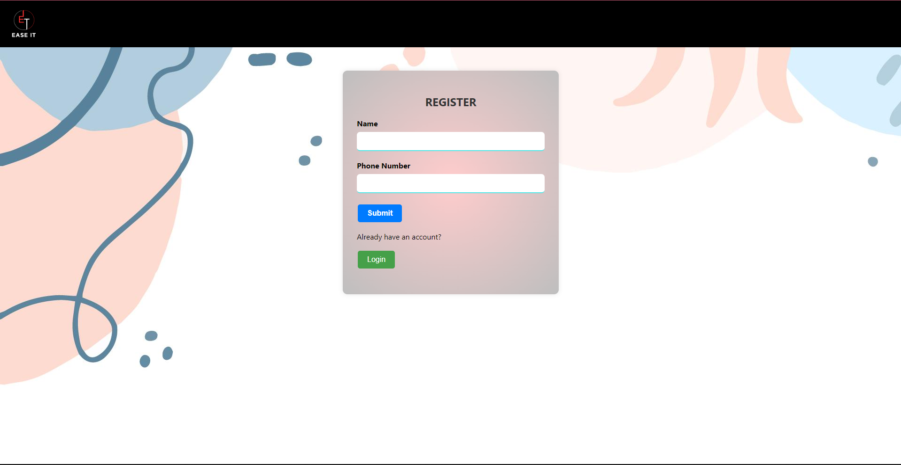
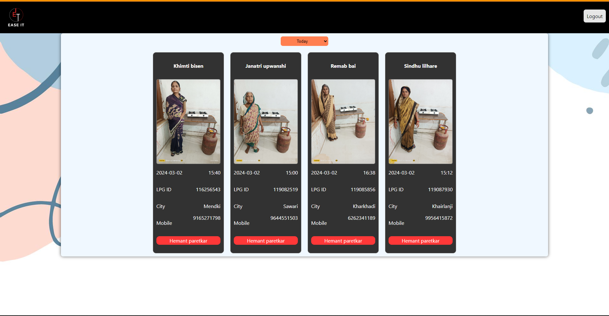
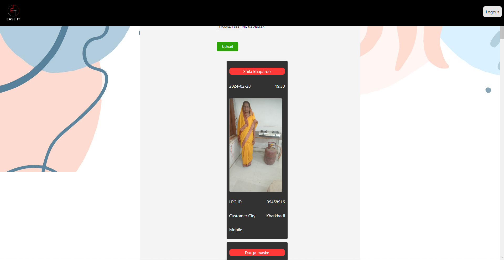

# LPG Distribution Management Web Application
## Overview
This project is a web application designed for local LPG distributors to manage customer data efficiently, specifically tailored for tracking customers under the Pradhan Mantri Ujjwala Yojana (PMUY). The application simplifies the process of capturing customer details and associated photos during connection deliveries, replacing the traditional paper-based record-keeping system.

## Technologies Used
__Frontend__: _React, HTML, CSS_
__State Management__: _Redux (with Redux Persist for persistent state)_
__Authentication__: _Firebase Authentication_
__Database__: _Firebase Realtime Database_
__Hosting Platform__: _Firebase Hosting_
__IDE__: _Visual Studio Code_

## Features by Portal
1. ### Delivery Boy Portal
- __Signup and Login__: Delivery boys can register using their phone numbers and OTP for authentication. Subsequent logins are streamlined with phone number-based authentication.
- __Customer Data Entry__: Delivery boys can fill out a form with customer details (name, address, etc.) and upload a photo of the customer during connection delivery.
- __My Submissions__: Delivery boys can view a list of their submissions, including customer details and photos.
2. ### Admin Portal
- __Signup and Login__: Admins register and log in using phone number-based authentication.
- __Today's Submissions__: Admins can view submissions made by delivery boys on the current day. If no submissions are made, a designated message or animation informs about the absence of submissions.
- __Deliveryman Overview__: Admins can access a dropdown list of delivery boys and view each delivery man's submission history by selecting their name.

## Database Structure
The Firebase Realtime Database is structured to store:

- Delivery boy information (phone number, submissions)
- Customer data linked to delivery submissions (name, address, photo URL)
- Log of submissions with timestamps for tracking and review
## Deployment and State Management
The application is deployed using Firebase Hosting for easy access and scalability. Redux with Redux Persist is utilized for state management, ensuring that user sessions and data persist across page reloads.

## Git Repository
The Git repository for this project contains the source code, detailed documentation, and setup instructions for better understanding and replication of the system. It showcases the implementation of frontend components, authentication, database integration, and state management using Redux.

## Screenshots

__Start Up Page__

__Start Up Page__

__Login Page__

### Admin Portal
__Today's Submission__

__Delivery Man List__

__Delivery Man Submission__

### Delivery Man Portal
__Delivery Man Form__

__Delivery Man Submission__

